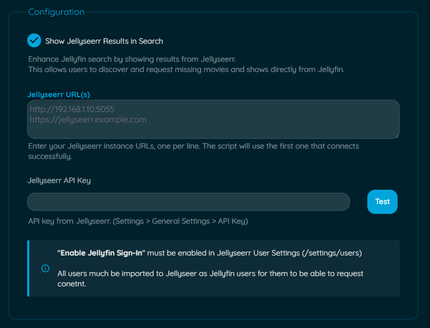
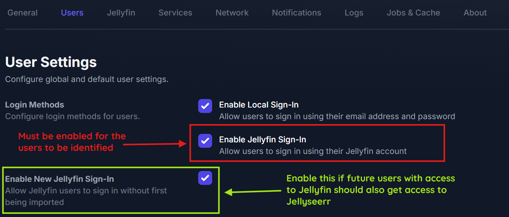
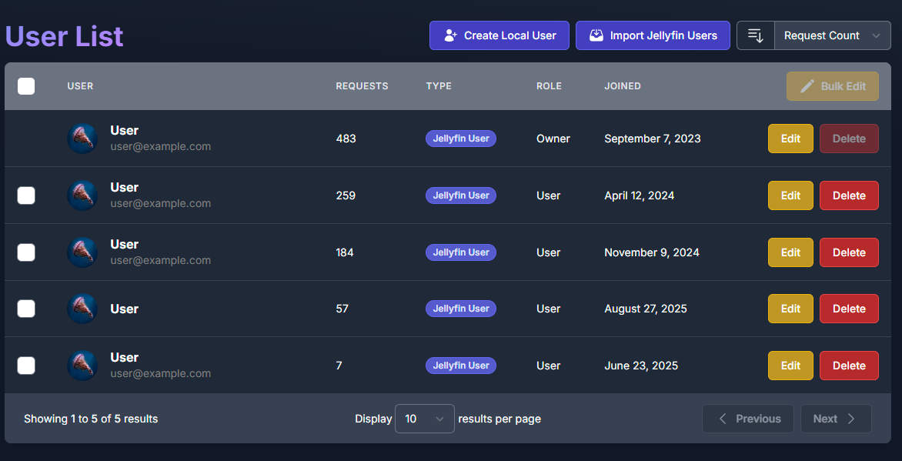
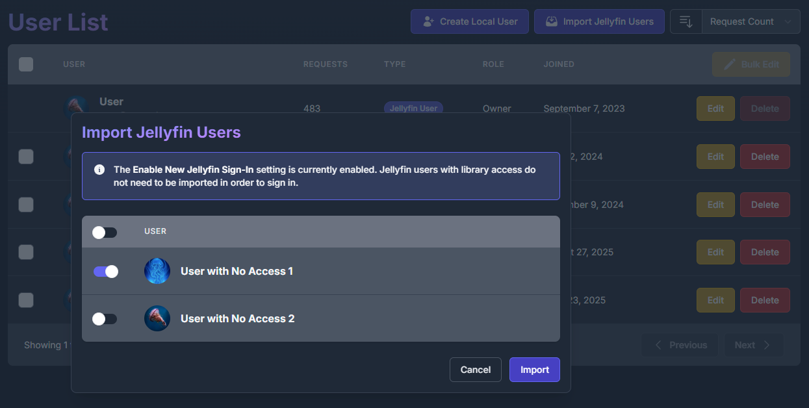
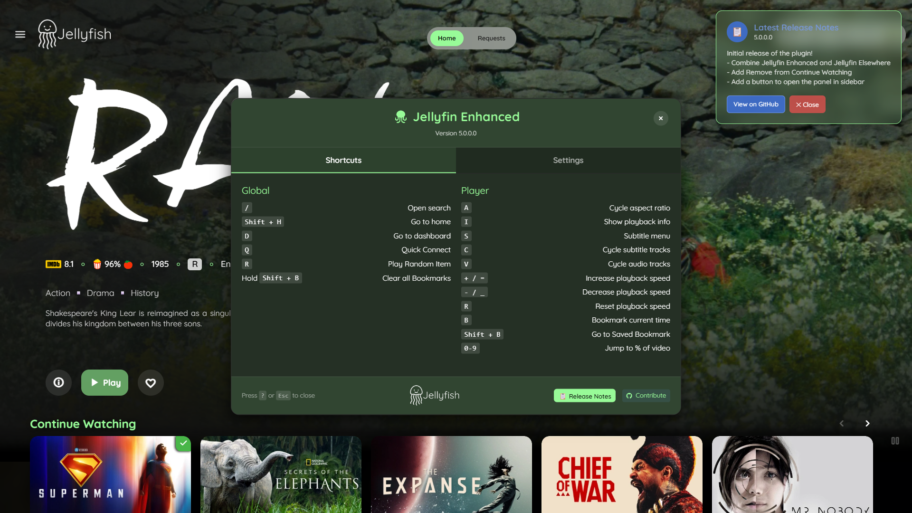
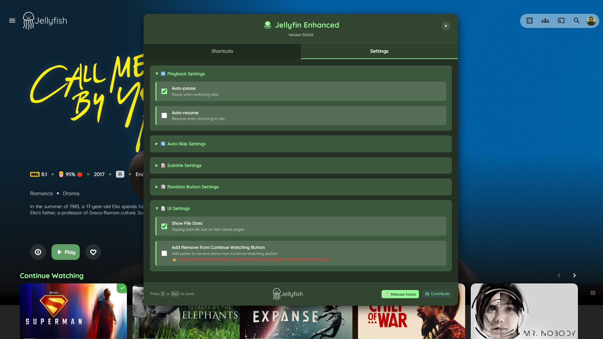
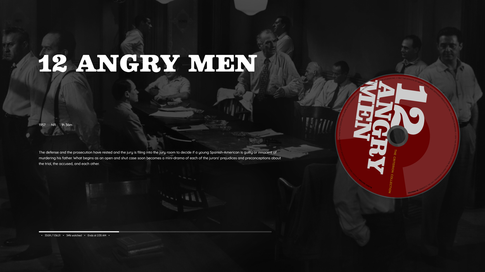

# Jellyfin Enhanced

<p align="center">
  
  
  
</p>
<br>

The ultimate enhancement for your Jellyfin experience. This plugin (previously script) combines the powerful features of Jellyfin Enhanced and [Jellyfin Elsewhere](https://github.com/n00bcodr/Jellyfin-Elsewhere/) and more into one easy-to-install package.


<br><details>
<summary style="font-size: 1em; font-weight: 600;">Jellyfin Enhanced with Default Theme</summary>
<br>

</details><br>


## ✨ Features

The Jellyfin Enhanced plugin brings a host of features to your Jellyfin web interface:

- **⌨️ Advanced Keyboard Shortcuts:** A comprehensive set of hotkeys for navigation, playback control, and more.
- **📝 Customizable Subtitles:** Fine-tune the appearance of subtitles with presets for style, size, and font.
- **⏯️ Smart Playback:** Auto-pause when you switch tabs and auto-resume when you return.
- **↪️ Auto-Skip Intros/Outros:** Binge-watch seamlessly without interruption (requires Intro Skipper plugin).
- **🎲 Random Item Button:** Discover something new in your library with a single click.
- **👁️ Remove from Continue Watching:** Easily clean up your home screen.
- **🔍 Streaming Provider Lookup:** See where else your media is available to stream across multiple regions.
- **🎬 Custom Pause Screen:** A beautifully designed, informative overlay when you pause a video. This feature is a modified version of the original script by [BobHasNoSoul](https://github.com/BobHasNoSoul/Jellyfin-PauseScreen).
- **🏷️ Quality Tags:** See media quality (4K, HDR, Atmos) at a glance directly on the posters. This is a modified and rewritten version of the original script by [BobHasNoSoul](https://github.com/BobHasNoSoul/Jellyfin-Qualitytags/).
- **🔗 .arr Links Integration:** For administrators, quickly jump to the Sonarr, Radarr, or Bazarr page for any item.
- **🌍 Multi-language Support:** The interface is available in multiple languages, with more on the way.

<br>

> 🌍 Internationalization & Translations\
> \
  Jellyfin Enhanced is now available in multiple languages! The plugin will automatically detect and apply the language set in your Jellyfin user profile.\
      **Currently Supported Languages**: English (en), Danish (da), German (de), French (fr), Italian (it), Swedish (sv). To note: These are translated using AI, and can be extermely inaccurate 😅\
      \
      I need Your Help!\
      Is your language missing or incorrect? You can help translate Jellyfin Enhanced for the community! It's a simple process:\
        - Find the Translation Files: Navigate to the Jellyfin.Plugin.JellyfinEnhanced/js/locales/ directory in this repository.\
        - Copy the English File: Make a copy of en.json and rename it to your language's two-letter ISO 639-1 code (e.g., es.json for Spanish, pl.json for Polish).\
        - Translate: Open your new file and translate the English text on the right side of the colons (:).\
        - Submit a Pull Request: Once you're done, submit a pull request with your new translation file.\


<p align="center">
--------------------------------------------------
</p>

## Jellyseerr Search Integration 

The Jellyfin Enhanced plugin can integrate with your Jellyseerr instance, allowing users to search for and request media directly from the Jellyfin search interface.

#### Setup

To enable the Jellyseerr integration, you must first configure it in the plugin settings:

1. Navigate to **Dashboard > Plugins > Jellyfin Enhanced**.
2. Go to the **Jellyseerr Settings** tab.
3. Check the **Show Jellyseerr Results in Search** box to enable the feature.
4. Enter your **Jellyseerr URL(s)**, one per line. The plugin will use the first one that connects successfully. Should be the same Jellyseerr Instance. Intended for providing internal and external urls, ideally just internal URL should work.
5. Enter your **Jellyseerr API Key**. You can find this in Jellyseerr under **Settings > General > API Key**.
6. You can use the test button to see if your Jellyseerr instance is reachable.
7. Click **Save**.

<p align="center">
  
</p>

> [!IMPORTANT]
> For the integration to work, you must also enable **"Enable Jellyfin Sign-In"** in your Jellyseerr User Settings (`/settings/users`).
> \
>  \
> \
> All users who need access to request content must be imported into Jellyseerr as Jellyfin users.
> <table align="center">
> <tr><th style="text-align:center">Users that have access</th><th style="text-align:center">Users that don't have access (import them)</th>  </tr>  <tr>    <td></td>    <td></td>  </tr>  </table>

#### Icon States

When on the search page, a Jellyseerr icon will appear to indicate the connection status. This is the first thing to check when troubleshooting issues.

| Icon | State | Description |
| :---: | :--- | :--- |
| | **Active** | Jellyseerr is successfully connected, and the current Jellyfin user is correctly linked to a Jellyseerr user. <br> Results from Jellyseerr will load along with Jellyfin and requests can be made. |
|  | **User Not Found** | Jellyseerr is successfully connected, but the current Jellyfin user is not linked to a Jellyseerr account. <br>Ensure the user has been imported into Jellyseerr from Jellyfin. Results will not load. |
|  | **Offline** | The plugin could not connect to any of the configured Jellyseerr URLs. <br> Check your plugin settings and ensure Jellyseerr is running and accessible. Results will not load. |


---


<br>

### How It Works?

To ensure security and prevent browser-related Cross-Origin Resource Sharing (CORS) errors, the Jellyfin Enhanced plugin does not communicate directly with the Jellyseerr API from your browser. Instead, it uses the Jellyfin server as a proxy. This method keeps your Jellyseerr API key safe on the server and avoids security issues.

In doing so, the plugin exposes a few proxy endpoints for its own use and for troubleshooting.

<br>
<details>
<summary style="font-size: 1.25em; font-weight: 600;">🔌 Jellyseerr API Endpoints</summary>
<br>

You can use these `curl` commands to directly interact with the plugin's API for troubleshooting. You will need to replace the placeholder values with your own.

#### Get Plugin Version

This endpoint checks the installed version of the Jellyfin Enhanced plugin.

```bash
curl -X GET\
  "<JELLYFIN_ADDRESS>/JellyfinEnhanced/version"
```

<br/>

#### Get Jellyseerr Connection Status

Checks if the plugin can connect to any of the configured Jellyseerr URLs using the provided API key.

```bash
curl -X GET\
  -H "X-Emby-Token: <JELLYFIN_API_KEY>"\
  "<JELLYFIN_ADDRESS>/JellyfinEnhanced/jellyseerr/status"
```

<br/>

#### Get Jellyseerr User Status

Verifies that the currently logged-in Jellyfin user is successfully linked to a Jellyseerr user account.

```bash
curl -X GET\
  -H "X-Emby-Token: <JELLYFIN_API_KEY>"\
  -H "X-Jellyfin-User-Id: <JELLYFIN_USER_ID>"\
  "<JELLYFIN_ADDRESS>/JellyfinEnhanced/jellyseerr/user-status"
```

<br/>

#### Perform a Jellyseerr Search

Executes a search query through the Jellyseerr instance for the specified user.

```bash
curl -X GET\
  -H "X-Emby-Token: <JELLYFIN_API_KEY>"\
  -H "X-Jellyfin-User-Id: <JELLYFIN_USER_ID>"\
  "<JELLYFIN_ADDRESS>/JellyfinEnhanced/jellyseerr/search?query=Inception"
```

<br/>

#### Make a Request on Jellyseerr

Submits a media request to Jellyseerr on behalf of the specified user. \
mediaType can be `tv` or `movie` \
mediaId is the TMDB ID of the item

```bash
curl -X POST\
  -H "X-Emby-Token: <JELLYFIN_API_KEY>"\
  -H "X-Jellyfin-User-Id: <JELLYFIN_USER_ID>"\
  -H "Content-Type: application/json"\
  -d '{"mediaType": "movie", "mediaId": 27205}'\
  "<JELLYFIN_ADDRESS>/JellyfinEnhanced/jellyseerr/request"
```

</details>

## 🔧 Installation

1.  In Jellyfin, go to **Dashboard** > **Plugins** > **Catalog** > ⚙️
2.  Click **➕** and give the repository a name (e.g., "Jellyfin Enhanced").
3.  Set the **Repository URL** to: `https://raw.githubusercontent.com/n00bcodr/jellyfin-enhanced/main/manifest.json`
4.  Click **Save**.
5.  Go to the **Catalog** tab, find **Jellyfin Enhanced** in the list, and click **Install**.
6.  **Restart** your Jellyfin server to complete the installation.


<br>
<details>
<summary style="font-size: 1em;">🐳 Docker Installation Notes</summary>
<br>

  > [!NOTE]
  > If you are on a docker install it is highly advisable to have [file-transformation](https://github.com/IAmParadox27/jellyfin-plugin-file-transformation) at least v2.2.1.0 installed. It helps avoid permission issues while modifying index.html


If you're running Jellyfin through Docker, the plugin may not have permission to modify jellyfin-web to inject the script. If you see permission errors such as `'System.UnauthorizedAccessException: Access to the path '/jellyfin/jellyfin-web/index.html ' is denied.` in your logs, you will need to map the `index.html` file manually:

1. Copy the index.html file from your container:

   ```bash
   docker cp jellyfin:/jellyfin/jellyfin-web/index.html /path/to/your/jellyfin/config/index.html
   ```

2. Add a volume mapping to your Docker run command:

   ```yaml
   -v /path/to/your/jellyfin/config/index.html:/jellyfin/jellyfin-web/index.html
   ```

3. Or for Docker Compose, add this to your volumes section:
   ```yaml
   services:
     jellyfin:
       # ... other config
       volumes:
         - /path/to/your/jellyfin/config:/config
         - /path/to/your/jellyfin/config/index.html:/jellyfin/jellyfin-web/index.html
         # ... other volumes
   ```

This gives the plugin the necessary permissions to inject JavaScript into the web interface.

</details>

---
## 💡 FAQ & Troubleshooting

Here are some common questions and solutions for issues you might encounter with the Jellyfin Enhanced plugin.

### Frequently Asked Questions

**Q: Can I customize the keyboard shortcuts?** \
 **A:** Yes, you can! Open the Jellyfin Enhanced panel by clicking the menu item in the sidebar or pressing `?`. In the "Shortcuts" tab, you can click on any key to set a new custom shortcut.

**Q: Does this plugin work on the Jellyfin mobile app?** \
**A:** Yes, the plugin is compatible with the official Jellyfin Android and iOS apps, as well as the desktop and web UIs.

**Q: Does this plugin work on the Android TV or any other TV?** \
**A:** No, this plugin does not work on the native Jellyfin app for Android TV, or other similar TV platforms. The plugin taps into the Jellyfin web interface, so it only functions on clients that use the embedded web UI, such as the official Web, Desktop, and mobile apps.

**Q: Why is the "Remove from Continue Watching" feature a destructive action?** \
**A:** This feature works by resetting the playback progress of an item to zero. While this removes it from the "Continue Watching" list, it also means the user's watch history for that item is lost.

**Q: Where is the userscript?** \
**A:** With the plugin functionality growing and diverging from the userscript, I had to remove it and installation method to avoid confusion. But if you just want the keyboard shortcuts and other functionality, the last updated version is [**here**](https://github.com/n00bcodr/Jellyfin-Enhanced/raw/05dd5b54802f149e45c76102dabf6235aaf7a5fb/jf_enhanced.user.js)

**Q: How do I change the plugin's language?**\
**A:** The plugin automatically uses the language set in your Jellyfin user profile. If your language isn't available, it will default to English. See the "Internationalization" section above to learn how you can contribute a translation!

### Troubleshooting Guide

Here is a list of common errors you might see in your Jellyfin server logs or your browser's developer console, and what they mean.

**Server Logs (`Jellyfin Server Dashboard > Logs`)**

| Error Message | Meaning & Solution |
| --- | --- |
| `Access to the path '/jellyfin/jellyfin-web/index.html ' is denied.` | **Meaning:** The plugin was unable to edit the `index.html` file to inject its script. <br> **Solution:** This is common in Docker installs. Follow the **Docker Installation Notes** in the README to correctly map the `index.html` file or use file-transformation plugin. |

---

## 🧪 Compatibility

- Official Jellyfin Web UI
- Official Jellyfin Android and iOS Apps
- Official Jellyfin Desktop Apps

> [!NOTE]
> Functionality does not work on anything that does not use Jellyfin Embedded web UI, such as 3rd party apps, Android TV App etc.

## 🎨 Custom Styling

<details>
<summary style="font-size: 1.2em;">Pause Screen</summary>
<br>

If you do not want an element in the pause screen, you can customize by hiding them to your liking.

| Element | CSS Selector | Example CSS to Hide |
| --- | --- | --- |
| **Logo** | `#pause-screen-logo` | `#pause-screen-logo { display: none; }` |
| **Details** (Year, Rating, Runtime) | `#pause-screen-details` | `#pause-screen-details { display: none; }` |
| **Plot/Description** | `#pause-screen-plot` | `#pause-screen-plot { display: none; }` |
| **Entire Progress Bar** | `#pause-screen-progress-wrap` | `#pause-screen-progress-wrap { display: none; }` |
| **Spinning Disc** | `#pause-screen-disc` | `#pause-screen-disc { display: none; }` |
| **Blurred Backdrop** | `#pause-screen-backdrop` | `#pause-screen-backdrop { display: none; }` |
| **Time Display** (Current / Total) | `.progress-time` | `.progress-time { display: none; }` |
| **"Ends At" Time** | `.progress-ends-at` | `.progress-ends-at { display: none; }` |
| **Percentage Watched** | `.progress-percentage` | `.progress-percentage { display: none; }` |

</details>

<br>
<details>
<summary style="font-size: 1.2em;">Quality Tags</summary>
<br>

Quality tags are injected into each card/poster with this structure:

```html
<div class="cardImageContainer" style="position: relative;">
    <div class="quality-overlay-container">
        <div class="quality-overlay-label resolution" data-quality="4K">4K</div>
        <div class="quality-overlay-label video-codec" data-quality="HDR">HDR</div>
        <div class="quality-overlay-label audio-codec" data-quality="ATMOS">ATMOS</div>
    </div>
</div>
```

## Classes & Attributes

* **`.quality-overlay-container`** → Wrapper for all tags (positioned top-left by default).
* **`.quality-overlay-label`** → Base class for each tag.
* **Category classes**:
  * `.resolution` – resolution tags (`8K`, `4K`, `1080p`, `LOW-RES`, etc.)
  * `.video-codec` – video features (`HDR`, `Dolby Vision`, etc.)
  * `.audio-codec` – audio formats/channels (`ATMOS`, `DTS`, `5.1`, etc.)
* **`data-quality="..."`** → Exact tag text (e.g. `data-quality="HDR10+"`).

<br>

### Customization Examples
----------------------


| Element                     | CSS Selector                                     | Example CSS                                                                                                      |
| --------------------------- | ------------------------------------------------ | ---------------------------------------------------------------------------------------------------------------- |
| **All Tags**                | `.quality-overlay-label`                         | `.quality-overlay-label { font-size: 0.8rem !important; padding: 3px 10px !important; }`                         |
| **Tag Container Position**  | `.quality-overlay-container`                     | `.quality-overlay-container { left: auto !important; right: 6px !important; align-items: flex-end !important; }` |
| **Specific Tag (e.g., 4K)** | `.quality-overlay-label[data-quality="4K"]`      | `.quality-overlay-label[data-quality="4K"] { background-color: purple !important; }`                             |
| **HDR Tag**                 | `.quality-overlay-label[data-quality="HDR"]`     | `.quality-overlay-label[data-quality="HDR"] { border: 2px solid gold !important; }`                              |
| **Low Resolution Tag**      | `.quality-overlay-label[data-quality="LOW-RES"]` | `.quality-overlay-label[data-quality="LOW-RES"] { opacity: 0.7 !important; }`                                    |
| **Stack Tags Horizontally** | `.quality-overlay-container`                     | `.quality-overlay-container { flex-direction: row !important; flex-wrap: wrap !important; }`                     |

<br>

### CSS Examples
---------------------

* **Style all tags**

  ```css
  .quality-overlay-label {
      font-size: 0.8rem !important;
      border-radius: 4px !important;
  }
  ```

* **Target a category**

  ```css
  .quality-overlay-label.resolution { background: blue !important; }
  .quality-overlay-label.audio-codec { background: green !important; }
  ```

* **Target a specific tag**

  ```css
  .quality-overlay-label[data-quality="HDR"] {
      border: 2px solid gold !important;
  }
  ```

  ```css
  .quality-overlay-label[data-quality="4K"] {
      background: linear-gradient(45deg, #c0392b, #e74c3c) !important;
      color: white !important;
      order: -1; /* Appear first */
  }
  ```


* **Hide unwanted tags**

  ```css
  /* Hide all low-res */
  .quality-overlay-label[data-quality="LOW-RES"] { display: none !important; }

    /* Only show resolution tags */
  .quality-overlay-label.video-codec,
  .quality-overlay-label.audio-codec{ display: none !important; }
  ```

> [!Note]
>* Always use `!important` to ensure your custom styles override the defaults.
>* Only the **best resolution** tag per item is shown (e.g. you won’t see both 4K and 1080p).
>* `LOW-RES` is the fallback for anything below 480p.
>* Tags are sorted automatically with resolution first, then video features, then audio.


</details>


<br>
<details>
<summary style="font-size: 1.25em; font-weight: 600;">Enhanced Panel</summary>
<br>

While the script automatically themes itself with Jellyfish, you can apply your own custom look on any theme.
Sample styling

```css

    /*
    * ===================================================================
    * Universal Style Override for the Jellyfin Enhanced Panel
    * ===================================================================
    */

    /* --- Main Panel & Backdrop --- */
    #jellyfin-enhanced-panel {
        background: rgba(25, 35, 45, 0.85) !important;
        border: 1px solid rgba(125, 150, 175, 0.3) !important;
        backdrop-filter: blur(20px) !important;
        color: #e6e6e6 !important;
        box-shadow: 0 10px 40px rgba(0, 0, 0, 0.5) !important;
    }

    /* --- Panel Header --- */
    #jellyfin-enhanced-panel > div:first-child {
        background: rgba(0, 0, 0, 0.25) !important;
        border-bottom: 1px solid rgba(125, 150, 175, 0.3) !important;
    }

    /* --- Main Title ("Jellyfin Enhanced") --- */
    #jellyfin-enhanced-panel div[style*="-webkit-background-clip: text"] {
        background: linear-gradient(135deg, #00a4dc, #aa5cc3) !important;
        -webkit-background-clip: text !important;
        -webkit-text-fill-color: transparent !important;
    }

    /* --- Tab Buttons --- */
    #jellyfin-enhanced-panel .tab-button {
        background: rgba(0, 0, 0, 0.2) !important;
        color: rgba(255, 255, 255, 0.6) !important;
        border-bottom: 3px solid transparent !important;
    }

    #jellyfin-enhanced-panel .tab-button:hover {
        background: rgba(0, 0, 0, 0.4) !important;
        color: #ffffff !important;
    }

    #jellyfin-enhanced-panel .tab-button.active {
        color: #ffffff !important;
        border-bottom-color: #00a4dc !important;
        background: rgba(0, 0, 0, 0.3) !important;
    }

    /* --- Section Headers & <details> Summary --- */
    #jellyfin-enhanced-panel h3,
    #jellyfin-enhanced-panel details summary {
        color: #00a4dc !important;
    }

    /* --- Collapsible <details> Sections --- */
    #jellyfin-enhanced-panel details {
        background-color: rgba(0, 0, 0, 0.2) !important;
        border: 1px solid rgba(125, 150, 175, 0.2) !important;
    }

    /* --- Keyboard Key Styling (<kbd>) --- */
    #jellyfin-enhanced-panel kbd,
    .shortcut-key {
        background: #34495e !important;
        color: #ecf0f1 !important;
        border: 1px solid #2c3e50 !important;
        box-shadow: 0 2px 0 #2c3e50;
    }

    /* --- Toggles & Checkboxes --- */
    #jellyfin-enhanced-panel input[type="checkbox"] {
        accent-color: #aa5cc3 !important;
    }

    /* --- Panel Footer --- */
    #jellyfin-enhanced-panel .panel-footer {
        background: rgba(0, 0, 0, 0.25) !important;
        border-top: 1px solid rgba(125, 150, 175, 0.3) !important;
    }

    /* --- Buttons in Footer --- */
    #jellyfin-enhanced-panel .footer-buttons a,
    #jellyfin-enhanced-panel .footer-buttons button {
        background-color: rgba(255, 255, 255, 0.08) !important;
        transition: background-color 0.2s ease;
    }

    #jellyfin-enhanced-panel .footer-buttons a:hover,
    #jellyfin-enhanced-panel .footer-buttons button:hover {
        background-color: rgba(255, 255, 255, 0.15) !important;
    }

    /* --- Style for Toast Notifications --- */
    .jellyfin-enhanced-toast {
        background: linear-gradient(135deg, #00a4dc, #aa5cc3) !important;
        color: white !important;
        border: none !important;
        backdrop-filter: blur(10px) !important;
    }

```

</details>

## 📸 Screenshots

<table align="center">
  <tr>
    <th style="text-align:center">Shortcuts</th>
    <th style="text-align:center">Settings</th>
  </tr>
  <tr>
    <td></td>
    <td></td>
  </tr>
  <tr>
    <th style="text-align:center">Pausescreen</th>
  </tr>
  <tr>
    <td></td>
  </tr>
  </table>


<br><br>
<details>
<summary style="font-size: 1.25em; font-weight: 600;">🫚Project Structure </summary>
<br>

The original monolithic `plugin.js` has been refactored into a modular, component-based structure to improve maintainability, readability, and scalability. The new architecture uses a single entry point (`plugin.js`) that dynamically loads all other feature components.

### File Structure

All client-side scripts are now located in the `Jellyfin.Plugin.JellyfinEnhanced/js/` directory.

```

Jellyfin.Plugin.JellyfinEnhanced/
└── js/
    ├── locales/
    │ ├── <language1>.json
    │ ├── <language2>.json
    ├── enhanced/
    │ ├── config.js
    │ ├── events.js
    │ ├── features.js
    │ ├── playback.js
    │ ├── subtitles.js
    │ └── ui.js
    ├── arr-links.js
    ├── elsewhere.js
    ├── jellyseerr.js
    ├── pausescreen.js
    ├── qualitytags.js
    └── plugin.js
```


### Component Breakdown

* **`plugin.js`**: This is the new main entry point for the plugin. Its sole responsibility is to load the plugin configuration from the server and then dynamically inject the other component scripts into the page in the correct order.

* **`/enhanced/`**: This directory contains the core components of the "Jellyfin Enhanced" feature set.
    * **`config.js`**: Manages all settings, both from the plugin backend and the user's local storage. It initializes and holds shared variables and configurations that other components access.
    * **`subtitles.js`**: Isolates all logic related to subtitle styling, including presets and the function that applies styles to the video player.
    * **`ui.js`**: Responsible for creating, injecting, and managing all visual elements like the main settings panel, toast notifications, and various buttons.
    * **`playback.js`**: Centralizes all functions that directly control the video player, such as changing speed, seeking, cycling through tracks, and auto-skip logic.
    * **`features.js`**: Contains the logic for non-playback enhancements like the random item button, file size display, audio language display, and "Remove from Continue Watching".
    * **`events.js`**: The active hub of the plugin. It listens for user input (keyboard/mouse), browser events (tab switching), and DOM changes to trigger the appropriate functions from other components.

* **`arr-links.js`**: This script adds convenient links to Sonarr, Radarr, and Bazarr on item detail pages, intended for administrator use.

* **`elsewhere.js`**: Powers the "Jellyfin Elsewhere" feature, which looks up where your media is available on other streaming services.

* **`jellyseerr.js`**: Handles the integration with Jellyseerr, managing the UI, authentication, and API calls for requesting media, and is loaded based on your plugin settings.

* **`pausescreen.js`**: Displays a custom, informative overlay when a video is paused.

* **`qualitytags.js`**: Manages the display of media quality information (like 4K, HDR, and Atmos) as tags directly on the posters.


</details>

## 📄 License

This project is licensed under the MIT License

---

<div align="center">

**Made with 💜 for Jellyfin and the community**

### Enjoying Jellyfin Enhanced?

Checkout my other repos!

[Jellyfin-Enhanced](https://github.com/n00bcodr/Jellyfin-Enhanced) (javascript/plugin) • [Jellyfin-Elsewhere](https://github.com/n00bcodr/Jellyfin-Elsewhere) (javascript) • [Jellyfin-Tweaks](https://github.com/n00bcodr/JellyfinTweaks) (plugin) • [Jellyfin-JavaScript-Injector](https://github.com/n00bcodr/Jellyfin-JavaScript-Injector) (plugin) • [Jellyfish](https://github.com/n00bcodr/Jellyfish/) (theme)


</div>