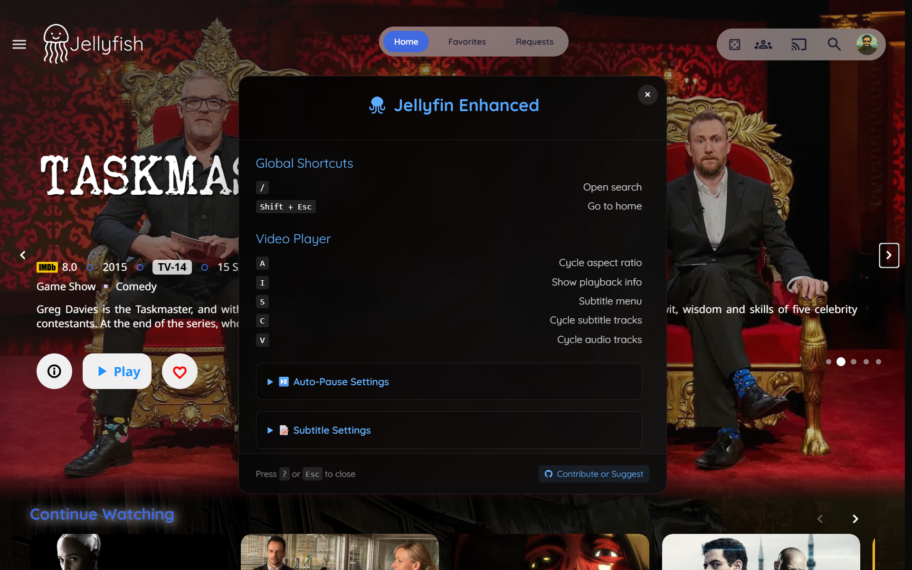

# Jellyfin Enhanced



An enhanced userscript that adds powerful keyboard shortcuts, customizable subtitle styling, and smart auto-pause features to Jellyfin's web interface.

## ✨ Features

### ⌨️ Keyboard Shortcuts
| Key           | Action                                                                 | Context       |
|---------------|------------------------------------------------------------------------|---------------|
| `?`           | Shows the settings panel with all hotkeys and customization options    | Global        |
| `/`           | Opens search page                                                      | Global        |
| `Shift + Esc` | Instantly return to Jellyfin Home Page                                 | Global        |
| `D`           | Go to Dashboard                                                        | Global        |
| `Q`           | Go to Quick Connect                                                    | Global        |
| `A`           | Cycle through aspect ratios (Auto → Cover → Fill) with visual feedback | Video Player  |
| `I`           | Shows playback info (stats overlay)                                    | Video Player  |
| `S`           | Shows subtitle selection menu                                          | Video Player  |
| `C`           | Cycle through subtitle tracks quickly                                  | Video Player  |
| `V`           | Cycle through audio tracks                                             | Video Player  |


### 📝 Subtitle Settings
- **6 Style Presets**: Clean White, Classic Black Box, Netflix Style, Cinema Yellow, Soft Gray, High Contrast
- **5 Font Sizes**: Tiny, Small, Normal, Large, Extra Large
- **5 Font Families**: Default, Noto Sans, Sans Serif, Typewriter, Consolas
- **Persistent Settings**: All settings are automatically saved and will persist across sessions

### ⏯️ Smart Auto-Pause/Resume
- **Configurable Auto-Pause**: Automatically pause when switching tabs or losing focus
- **Optional Auto-Resume**: Choose whether to resume playback when returning to the tab


## 🔧 Installation

You can install the script in one of below ways:

---

### **Method 1: Direct Integration**

*This method makes the enhancements available to all users on your Jellyfin server.*

1. **Locate your Jellyfin web root directory:**
   ```bash
   # Common paths:
   # Ubuntu/Debian: /usr/share/jellyfin/web/
   # Docker: /jellyfin/jellyfin-web/
   # Windows: C:\Program Files\Jellyfin\Server\jellyfin-web\
   ```

2. **Edit the index.html file:**
   ```bash
   sudo nano /usr/share/jellyfin/web/index.html
   ```

3. **Add the script reference before the closing `</head>` tag:**
   ```html
   <script defer src="hotkeys.js"></script>
   ```

4. **Download the enhanced script:**
   ```bash
   curl -o /usr/share/jellyfin/web/hotkeys.js https://raw.githubusercontent.com/n00bcodr/jellyfin-hotkeys/main/hotkeys.js
   ```

5. **Clear browser cache and reload Jellyfin**

> [!TIP]
> Check your Jellyfin server logs to find the exact web directory path for your installation.

---

### **Method 2: Plugin**

1. Install the [Custom JavaScript Plugin](https://github.com/johnpc/jellyfin-plugin-custom-javascript)

2. Navigate to **Dashboard -> Plugins -> Custom JavaScript**

3. Paste the contents of `hotkeys.js` into the text area

4. Restart Jellyfin

5. **Clear your browser cache** and **reload the Jellyfin Web Page**.

---

### **Method 3: Browser Extension (User-Specific)**

*This method works only in your browser and is perfect for personal use.*

1. **Install a userscript manager:**
   - [Tampermonkey](https://www.tampermonkey.net/) (Recommended)
   - [Violentmonkey](https://violentmonkey.github.io/)
   - [Greasemonkey](https://addons.mozilla.org/en-GB/firefox/addon/greasemonkey/) (Firefox)

2. **Install the script:**

   [](https://github.com/n00bcodr/Jellyfin-Hotkeys/raw/main/jellyfin-hotkeys.user.js)

3. **Alternative manual installation:**
   - Create a new userscript in your extension
   - Copy and paste the contents from the repository
   - Save and enable the script

---

## 🧪 Compatibility

**Tested and Verified:**
- Jellyfin 10.10.x Web UI and official Jellyfin Mobile Application
- Jellyfin 10.11.0 Web UI and official Jellyfin Mobile Application
- Chrome/Chromium browsers + Tampermonkey
- Firefox + Violentmonkey/Greasemonkey


## 📄 License

MIT License - free to use, modify, and distribute.

---

<div align="center">

**Enjoying Jellyfin Enhanced Hotkeys?**

⭐ Star the repository | 🐛 Report issues | 💡 Suggest features

[GitHub Repository](https://github.com/n00bcodr/Jellyfin-hotkeys) • [Latest Release](https://github.com/n00bcodr/Jellyfin-hotkeys/releases)

</div>